# RealTimeFaceAnalytics

This sample project is an example of **analyzing faces in real-time**,
by using **[Azure Cognitive Services](https://docs.microsoft.com/en-us/azure/cognitive-services/welcome)**,
mostly by **[Face API](https://docs.microsoft.com/en-us/azure/cognitive-services/Face/Overview)** service.

## Overview

### Description
Whole concept was invented up with **[Tauron](https://www.tauron.pl/dla-domu)** for a hackfest to create a **Proof of Concept** for:
- **Analyzing in real-time** customer's face features in customer service points, features such as gender, age, emotions, etc.
- Integrating devices with **cloud storage** and **cognitive services**.

We have made a decision with Tauron related to the target technology, in which the solution will be created (and with which services will be combined):
- A Desktop application written in **[WPF](https://docs.microsoft.com/en-us/dotnet/framework/wpf/getting-started/introduction-to-wpf-in-vs) (C#)** and/or Python.
- **Face API, Emotion API, Computer Vision API**, to collect data, such as gender, age, emotions, number of clients, etc.
- **[Azure SQL Database](https://azure.microsoft.com/en-us/services/sql-database/)**, to store collected data.
- **Azure SQL Database** with **[DirectQuery](https://docs.microsoft.com/en-us/power-bi/desktop-use-directquery)**, to receive direct data for **[Power BI](https://powerbi.microsoft.com/en-us/)** reports.

We achieved:
- [x] WPF Application with
  - [x] [Caliburn.Micro](https://caliburnmicro.com/),
  - [x] [Haar Cascade](https://docs.opencv.org/3.4.1/d7/d8b/tutorial_py_face_detection.html) local detector,
  - [x] [Frame grabber for real-time analysis](https://docs.microsoft.com/en-us/azure/cognitive-services/computer-vision/vision-api-how-to-topics/howtoanalyzevideo_vision),
  - [x] [Entity Framework](https://docs.microsoft.com/en-us/ef/) databinding.
- [x] Cognitive Services Face API service call.
- [x] Azure SQL Database server connection.
- [x] Power BI with DirectQuery data connection.
- [ ] Connect with other Cloud Services.
- [ ] Use data with Machine Learning services.

### Solution Architecture Overview:
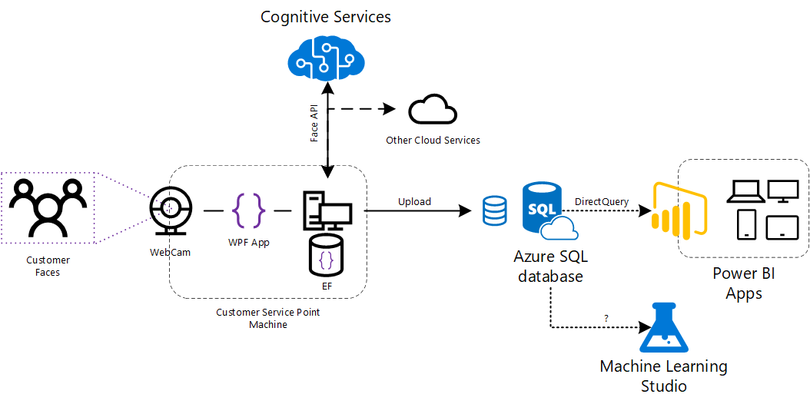

## Table of Contents

- [Project](#realtimefaceanalytics)  
- [Overview](#overview)  
  - [Description](#description)  
  - [Solution Architecture Overview](#solution-architecture-overview)  
- [Table of Contents](#table-of-contents)  
- [Prerequisites](#prerequisites)  
  - [Accounts](#accounts)  
    - [Microsoft Account](#microsoft-account)  
    - [Azure Subscription](#azure-subscription)  
    - [Azure SQL Database](#azure-sql-database)
    - [Cognitive Services](#cognitive-services)
  - [Software](#software)  
    - [Tools & Libraries](#tools-libraries)
    - [Power Bi Desktop](#power-bi-desktop)
  - [Devices](#devices)  
    - [PC](#pc)
    - [Web Camera](#web-camera) 
- [Usage](#usage)
  - [Application Setup](#application-setup)
  - [Application Run](#application-run)
  - [Application Highlights](#application-highlights)
  - [Database Upload](#database-upload)
  - [Database Check](#database-check)
  - [DirectQuery with Power Bi](#directquery-with-power-bi)
- [Learnings](#learnings)
- [Credits](#credits)
- [Helpful Materials](#helpful-materials)

## Prerequisites

To successfully run the application and use it, we need to prepare some remarkable things - if we do not do this, it may turn out that the app will not work correctly.

Be sure that you have these... :joy:

### Accounts

First, we need accounts that allow us to use specific services or applications.

#### Microsoft Account

We need this account in case of using Visual Studio and Azure Portal.
When you start Visual Studio for the first time, you're asked to sign in and provide some necessary registration information.
You should choose a Microsoft account or work or school account that best represents you.
If you don't have any of these accounts, you can [create a Microsoft account for free](https://account.microsoft.com/account).

#### Azure Subscription

Be sure that you have a valid [Azure Subscription](https://azure.microsoft.com/en-us/account/) with funds for such things as Azure SQL Database and Cognitive Services.
If not, several offers can help you.

- [Azure Free Account](https://azure.microsoft.com/en-us/offers/ms-azr-0044p/)
- [Azure for Students](https://azure.microsoft.com/en-us/free/students/)
- [Azure Pass](https://www.microsoftazurepass.com/Home/HowTo)

#### Azure SQL Database

You need a place where you will collect your data from real-time face analysis.
Adress, database name, user_id, and password needed!
In that case, you should create a new resource from your Azure Portal, which will be **Azure SQL Database**.

- [Create an Azure SQL database in the Azure portal](https://docs.microsoft.com/en-us/azure/sql-database/sql-database-get-started-portal)

#### Cognitive Services

We need Face API key and endpoint address.
It is possible to use free plan (**F0**) of Cognitive Services,
however for better experience and results, I recommend you to create a new plan (**S0**),
from higher pricing tier - [pricing](https://azure.microsoft.com/en-us/pricing/details/cognitive-services/face-api/).

- [Create a Cognitive Services APIs account in the Azure portal](https://docs.microsoft.com/en-us/azure/cognitive-services/cognitive-services-apis-create-account)

### Software

Of course, it is possible to run this application without Visual Studio,
however, in that case, you should consider downloading proper DLL's, setting-up dependencies and references,
configure application settings and more!

#### Tools & Libraries

Visual Studio installed, and proper frameworks to run **Windows Application** (WPF), **.NET Framework 4.5.2**.

- [Visual Studio IDE](https://www.visualstudio.com/vs/)

#### Power Bi Desktop

Power BI is a suite of business analytics tools that deliver insights throughout your organization.
We will use it to get insights into our data from face analysis.

- [Power BI Desktop](https://powerbi.microsoft.com/en-us/desktop/)

### Devices

#### PC


#### Web Camera

For sure providing frames in the applications is a must,
and without a camera, you won't be able to achieve any results.

I used **Creative Live! Cam Chat HD VF0790**. I believe laptop or any USB-like camera will be enough.

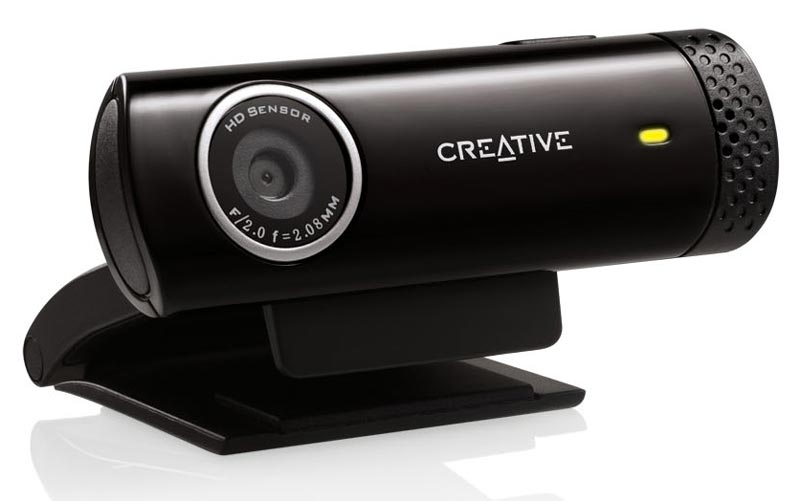

## Usage

First things first! Do not skip things that you should do first,
in that case, you need to correctly set-up the application.
Prepare your already created resources, connection strings, credentials, etc.

### Application Setup

1. Fill in **Cognitive Services keys and endpoints**.
(Don't worry if you miss that. You will be able to add these keys and endpoint during application runtime). 

- [RealTimeFaceAnalytics.Core/Properties/Settings.settings](RealTimeFaceAnalytics.Core/Properties/Settings.settings)

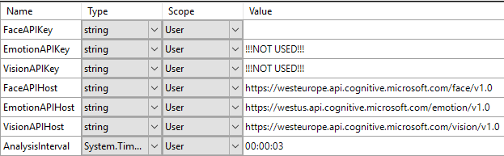

Face API service is enough, just put:
- **FaceAPIKey**
- **FaceAPIHost**
+ ***AnalysisInterval**, you can change it for different frame analysis frequency.

2. Configure **Connection String** in application configuration file
(you will find that particular block between line 36 and 40) with your **Azure SQL Database** credentials.

- [RealTimeFaceAnalytics.WPF/App.config](RealTimeFaceAnalytics.WPF/App.config)

```xml
<connectionStrings>
    <add name="FaceAnalyticsContext"
        connectionString="Server=tcp:{database_server_address};Database={database_name};User ID={user};Password={password};Encrypt=True;TrustServerCertificate=False;Connection Timeout=30;"
        providerName="System.Data.SqlClient" />
</connectionStrings>
```

Replace *connectionString* values. For example:

```
connectionString="Server=tcp:myserver.database.windows.net;Database=mydatabase_db;User ID=srvadmin;Password=*************;Encrypt=True;TrustServerCertificate=False;Connection Timeout=30;"
```

3. **Add rule** of your client IP address for Azure SQL Database server in **Firewalls and virtual networks** tab - [read more](https://docs.microsoft.com/en-us/azure/sql-database/sql-database-vnet-service-endpoint-rule-overview).

### Application Run

1. In Visual Studio set **RealTimeFaceAnalytics.WPF** project as a StartUp Project.
2. Be sure to add missing references and packages.
3. Rebuild
4. Run


- *Before you start to analyze frames from your camera stream, you will be able to configure your settings again:*
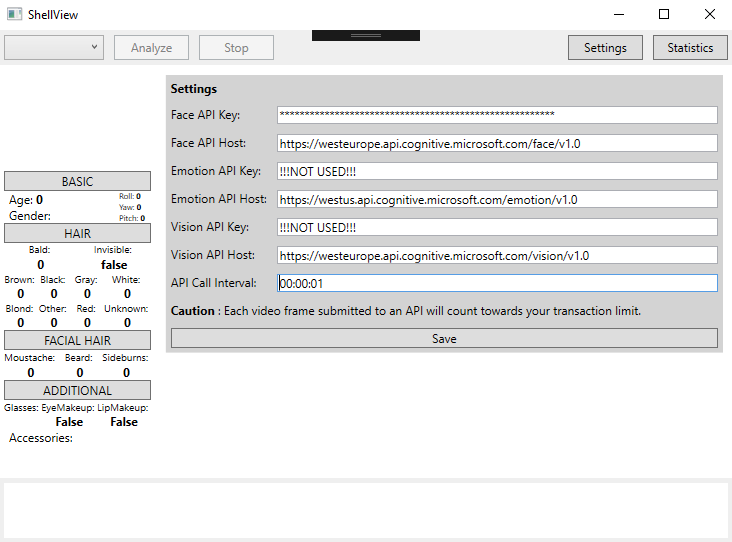

- *After clicking Save, choosing Camera and clicking Analyze, you will get a preview camera stream (without local detector) and camera main stream (with local detector):*
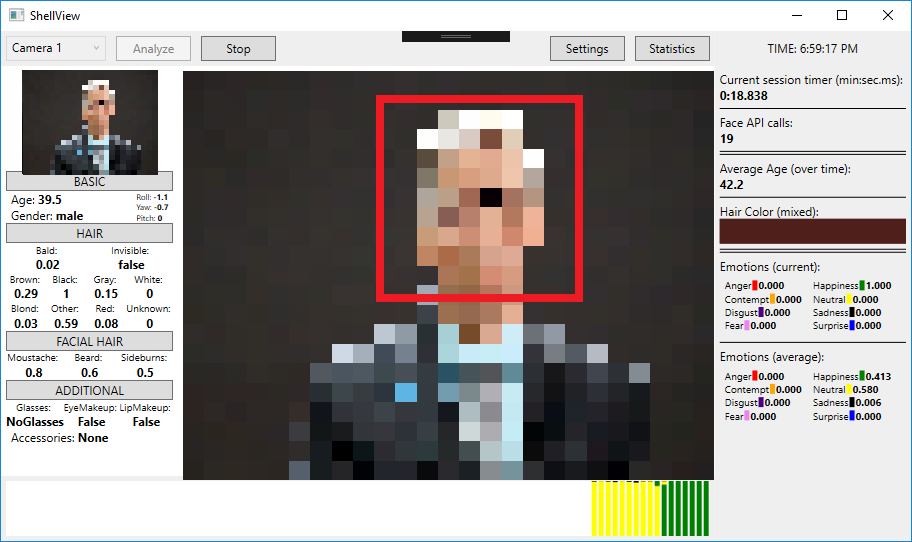

- *Emotions test (Emotions are measured over time and every tick/interval, you can see them as an average number on the right panel and as color bars on the timeline below image stream):*


- *Additional accessories test (Different kind of glasses and headwear):*


### Application Highlights

1. WPF Application with MVVM Architecture (Caliburn.Micro).
Caliburn Micro solved my problem - as a small yet powerful framework, designed for building WPF applications.
Great support for MVVM patterns enabled me to build a solution quickly.

Most important thing I setup for Caliburn support was [Bootstrapper.cs](RealtimeFaceAnalytics.WPF/Bootstrapper.cs) file - with simple IoC container configuration:
```csharp
public class Bootstrapper : BootstrapperBase
{
    private SimpleContainer _container;
    ...
    protected override void Configure()
    {
        ...
        _container = new SimpleContainer();
        _container.Singleton<IWindowManager, WindowManager>();
        ...
        _container.PerRequest<ShellViewModel>();
    }
    ...
}
```

2. Start of the Video Frame Analyzer Service process.


    2.1. Loading cameras:

    - in [ShellViewModel.cs](RealTimeFaceAnalytics.Core/ViewModels/ShellViewModel.cs)
    ```csharp
    public List<string> CameraList
    {
        get
        {
            var availableCameraList = _videoFrameAnalyzerService.GetAvailableCameraList();
            ...
        }
    }
    ```
    - in [VideoFrameAnalyzerService.cs](RealTimeFaceAnalytics.Core/Services/VideoFrameAnalyzerService.cs)
    ```csharp
    public List<string> GetAvailableCameraList()
    {
        return LoadCameraList();
    }
    ...
    private List<string> LoadCameraList()
    {
        var numberOfCameras = _frameGrabber.GetNumCameras();
        ...
        var cameras = Enumerable.Range(0, numberOfCameras).Select(i => $"Camera {i + 1}");
        return cameras.ToList();
    }
    ```
    - in [FrameGrabber.cs](VideoFrameAnalyzer/FrameGrabber.cs)
    ```csharp
    protected int NumCameras = -1;
    ...
    public int GetNumCameras()
    {
        if (NumCameras != -1) return NumCameras;
        ...
        while (NumCameras < 100)
        {
            using (var vc = VideoCapture.FromCamera(NumCameras))
            {
                if (vc.IsOpened())
                    ++NumCameras;
                else
                    break;
            }
        }
        return NumCameras;
    }
    ```

    2.2. Start processing with selected camera:

    - in [ShellViewModel.cs](RealTimeFaceAnalytics.Core/ViewModels/ShellViewModel.cs)
    ```csharp
    public void StartAnalyze()
    {
        ...
        _videoFrameAnalyzerService.StartProcessing(_selectedCameraList);
        ...
    }
    ```
    - in [VideoFrameAnalyzerService.cs](RealTimeFaceAnalytics.Core/Services/VideoFrameAnalyzerService.cs)
    ```csharp
    public void StartProcessing(string selectedCamera)
    {
        StartProcessingCamera(selectedCamera);
    }
    ...
    private async void StartProcessingCamera(string selectedCamera)
    {
        ...
        var selectedCameraIndex = GetSelectedCameraIndex(selectedCamera);
        await _frameGrabber.StartProcessingCameraAsync(selectedCameraIndex);
    }
    ```
    - in [FrameGrabber.cs](VideoFrameAnalyzer/FrameGrabber.cs)
    ```csharp
    public async Task StartProcessingCameraAsync(int cameraIndex = 0, double overrideFps = 0)
    {
        ...
        await StopProcessingAsync().ConfigureAwait(false);
        ...
        StartProcessing(TimeSpan.FromSeconds(1 / Fps), () => DateTime.Now);
        ...
    }
    ```

    2.3. Handle the events with results of frames and data (read more about **EventAggregator** in Caliburn.Micro):

    - creating events
      - [FaceAttributesResultEvent.cs](RealTimeFaceAnalytics.Core/Events/FaceAttributesResultEvent.cs)
      - [FrameImageProvidedEvent.cs](RealTimeFaceAnalytics.Core/Events/FrameImageProvidedEvent.cs)
      - [ResultImageAvailableEvent.cs](RealTimeFaceAnalytics.Core/Events/ResultImageAvailableEvent.cs)

    ```csharp
    using Microsoft.ProjectOxford.Face.Contract;
    ...    
        public class FaceAttributesResultEvent
        {
            public FaceAttributes FaceAttributesResult;
        }
    ...
    using System.Windows.Media.Imaging;
    ...
        public class FrameImageProvidedEvent
        {
            public BitmapSource FrameImage;
        }
        ...
        public class ResultImageAvailableEvent
        {
            public BitmapSource ResultImage;
        }
    ...
    ```
    - setup listeners and publishing events in [VideoFrameAnalyzerService.cs](RealTimeFaceAnalytics.Core/Services/VideoFrameAnalyzerService.cs)
    ```csharp
    private void SetUpListenerNewFrame()
    {
        _frameGrabber.NewFrameProvided += (s, e) =>
        {
            var detectedFacesRectangles = _localFaceDetector.DetectMultiScale(e.Frame.Image);
            e.Frame.UserData = detectedFacesRectangles;
            Application.Current.Dispatcher.BeginInvoke((Action) (() =>
            {
                var frameImage = e.Frame.Image.ToBitmapSource();
                var resultImage = _visualizationService.Visualize(e.Frame, _currentLiveCameraResult);
                _eventAggregator.PublishOnUIThread(new FrameImageProvidedEvent {FrameImage = frameImage});
                _eventAggregator.PublishOnUIThread(new ResultImageAvailableEvent {ResultImage = resultImage});
            }));
        };
    }
    ...
    private void SetUpListenerNewResultFromApiCall()
    {
        _frameGrabber.NewResultAvailable += (s, e) =>
        {
            Application.Current.Dispatcher.BeginInvoke((Action) (() =>
            {
                if (e.TimedOut)
                ...
                else if (e.Exception != null)
                ...
                else
                {
                    _currentLiveCameraResult = e.Analysis;
                    if (_currentLiveCameraResult.Faces.Length > 0)
                    {
                        _dataInsertionService.InitializeSessionInterval();
                        var faceAttributes = _currentLiveCameraResult.Faces[0].FaceAttributes;
                        _eventAggregator.PublishOnUIThread(
                        new FaceAttributesResultEvent {FaceAttributesResult = faceAttributes});
                    }
                }
            }));
        };
    }
    ```
    - handling events in [ShellViewModel.cs](RealTimeFaceAnalytics.Core/ViewModels/ShellViewModel.cs)   
    (*Updating Properties in ViewModel and Invoking Services*)
    ```csharp
    public class ShellViewModel : Screen, IHandle<FrameImageProvidedEvent>, IHandle<ResultImageAvailableEvent>,
        IHandle<FaceAttributesResultEvent>
    {
        ...
        public void Handle(FaceAttributesResultEvent message)
        {
            _dataInsertionService.InitializeSessionInterval();
            var faceAttributes = message.FaceAttributesResult;
            AssignFaceAttributes(faceAttributes);
            _dataInsertionService.AddAdditionalFeatures(faceAttributes);

            var averageAge = _faceService.CalculateAverageAge();
            AssignAverageAge(averageAge);
            _dataInsertionService.AddAverageAge(averageAge);

            var averageGender = _faceService.CalculateAverageGender();
            _dataInsertionService.AddAverageGender(averageGender);

            var emotionScores = faceAttributes.Emotion;
            GenerateAndPopulateEmotionBar(emotionScores);
            _emotionService.AddEmotionScoresToStatistics(emotionScores);
            _dataInsertionService.AddEmotions(emotionScores);

            var emotionScoresStatistics = _emotionService.CalculateEmotionScoresStatistics();
            AssignEmotionStatistics(emotionScoresStatistics);
            _dataInsertionService.AddAverageEmotions(emotionScoresStatistics);

            var hairColors = faceAttributes.Hair.HairColor;
            GenerateHairColor(hairColors);

            var faceApiCallCount = _faceService.GetFaceServiceClientApiCallCount();
            AssignFaceApiCallCount(faceApiCallCount);
            _dataInsertionService.AddFaceApiCallCount(faceApiCallCount);

            _dataInsertionService.AddSessionIntervalData();
            _dataInsertionService.AddSessionDuration(_stopWatch.Elapsed);
        }
        ...
        public void Handle(FrameImageProvidedEvent message)
        {
            FrameImage = message.FrameImage;
        }
        ...
        public void Handle(ResultImageAvailableEvent message)
        {
            ResultImage = message.ResultImage;
        }
    }
    ```

In general, we are using here ready-to-go VideoFrameAnalyzer project for frames grabbing and detecting faces locally.
If local haar cascade classifier detects a face, algorithm invokes Face API service for analysis.
In return, we are receiving data model of Face Attributes for that particular frame.

Additional features are:
- displaying current basic face attributes, based on captured frame
- displaying current face emotion attributes, based on captured frame
- displaying all occurring face emotion attributes over time (UI timeline), with dominant emotion
- displaying face emotion attributes statistics, based on face emotion attributes.

### Database Upload

1. With Entity Framework and Code-First approach creating model context was easy.

In [FaceAnalyticsContext.cs](RealtimeFaceAnalytics.Core/Models/FaceAnalyticsContext.cs) file you will find Code-First Entity Framework approach example:
```csharp
public class FaceAnalyticsContext : DbContext
    {
        public FaceAnalyticsContext() : base("name=FaceAnalyticsContext")
        {
        }

        public virtual DbSet<Customer> Customer { get; set; }
        public virtual DbSet<Emotions> Emotions { get; set; }
        public virtual DbSet<SessionInterval> SessionInterval { get; set; }
        public virtual DbSet<Hair> Hair { get; set; }
        public virtual DbSet<FacialHair> FacialHair { get; set; }
        public virtual DbSet<AdditionalFeatures> AdditionalFeatures { get; set; }
        public virtual DbSet<Accessories> Accessories { get; set; }
        public virtual DbSet<SessionServicesDetails> CognitiveService { get; set; }
        ...
        public virtual DbSet<Session> Session { get; set; }
    }

    public class Customer
    {
        ...
    }

    public class Emotions
    {
        ...
    }

    public class SessionInterval
    {
        ...
    }

    public class Hair
    {
        ...
    }

    public class FacialHair
    {
        ...
    }

    public class AdditionalFeatures
    {
        ...
    }

    public class Accessories
    {
        ...
    }

    public class SessionServicesDetails
    {
        ...
    }

    ...

    public class Session
    {
        public int SessionId { get; set; }

        ...
        public SessionServicesDetails SessionServicesDetails { get; set; }
        public DateTime? SessionDate { get; set; }
        public TimeSpan? SessionStartTime { get; set; }
        public TimeSpan? SessionEndTime { get; set; }
        public TimeSpan? SessionDuration { get; set; }
        public ICollection<SessionInterval> SessionIntervals { get; set; }
        public Customer Customer { get; set; }
    }
```

2. As you've seen before in event handling example, we are invoking **DataInsertionService** methods whenever frame result and face attributes come.
Then after stopping a session, we are preparing context and uploading it.

In [ShellViewModel.cs](RealTimeFaceAnalytics.Core/ViewModels/ShellViewModel.cs):
```csharp
public void StopAnalyze()
{
    StopProcessing();
    ...
}
...
private async void StopProcessing()
{
    ...
    await _videoFrameAnalyzerService.StopProcessing();
    _dataInsertionService.InsertSessionData();
    ...
}
```
In [DataInsertionService.cs](RealTimeFaceAnalytics.Core/Services/DataInsertionService.cs):
```csharp
public void InsertSessionData()
{
    InsertSessionDataToDatabaseContext();
}
...
private async void InsertSessionDataToDatabaseContext()
{
    ...
    using (var databaseContext = new FaceAnalyticsContext())
    {
        databaseContext.Session.Add(_session);
        await databaseContext.SaveChangesAsync();
    }
}
```

### Database Check

1. Checking if the context was uploaded correctly. Using SQL Server Object Explorer in Visual Studio:  
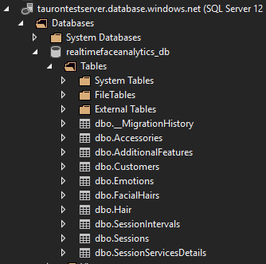

2. Checking data in tables:
  - Sessions  
    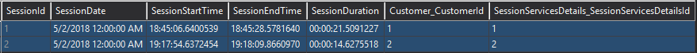
  - SessionIntervals  
    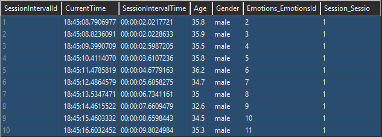
  - Customers  
    
  - Emotions  
    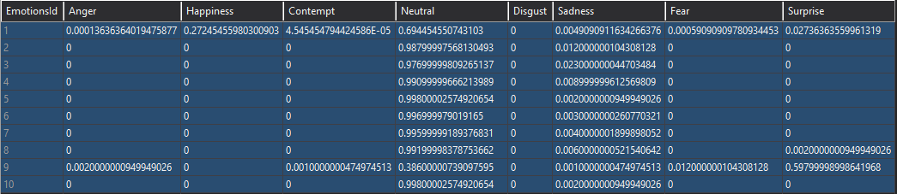

### DirectQuery with Power Bi

1. Great lecture about connecting data resources with Power BI: [Use DirectQuery in Power BI Desktop](https://docs.microsoft.com/en-us/power-bi/desktop-use-directquery)
2. Remember to make IP Whitelisting, in case you will receive this message:  
    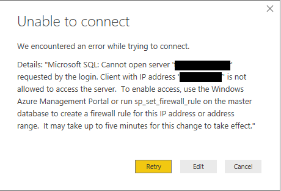
3. After connecting with database server you will be asked about tables you want to load:  
    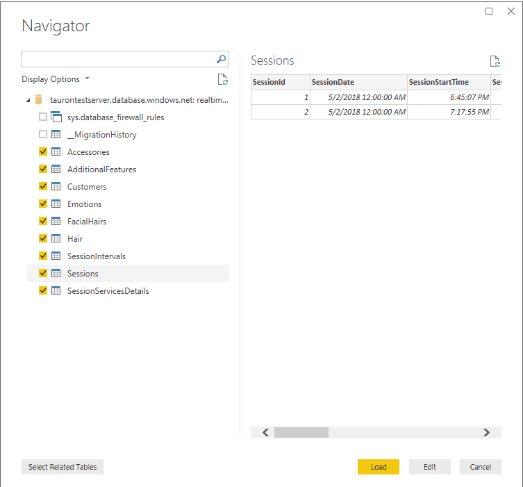
4. Loaded tables and hierarchy:  
    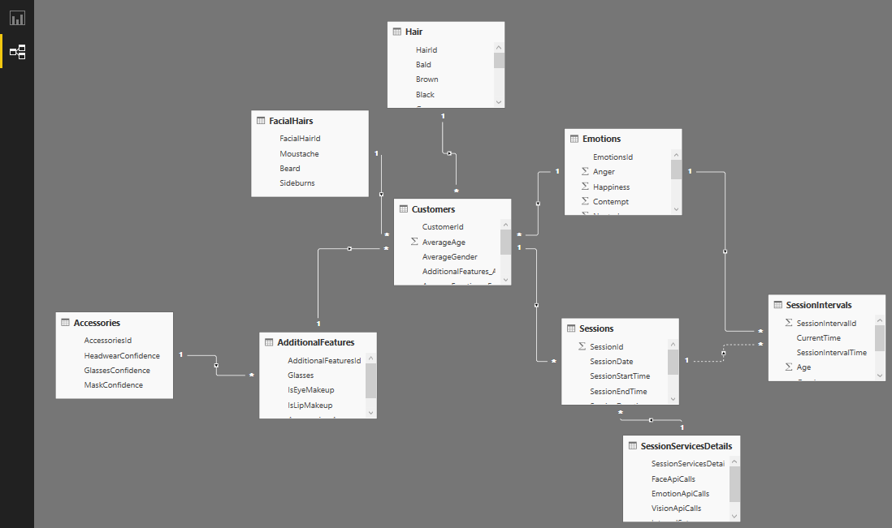
5. Sample Power Bi chart (Age over Time, in example session):  
    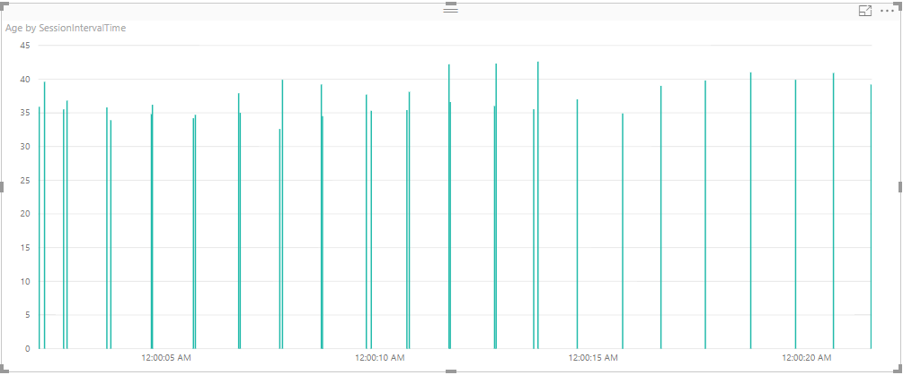

## Learnings


## Credits


## Helpful Materials

1. Other Projects  
- [Video Frame Analysis Sample](https://github.com/Microsoft/Cognitive-Samples-VideoFrameAnalysis)
- [Intelligent Kiosk](https://github.com/Microsoft/Cognitive-Samples-IntelligentKiosk)
- [Technical Case Study - BlueDynamic](https://github.com/pospanet/TechCaseStudy_BlueDynamic)
- [Signal Faces](https://github.com/msimecek/Signal-Faces) ([blogpost](https://codez.deedx.cz/projects/signal-faces/))
- [Windows IoT Core Cognitive Services Sample](https://github.com/Microsoft/Windows-iotcore-samples/tree/develop/Samples/CognitiveServicesExample)

2. Websites
- [How to Analyze Videos in Real-time](https://docs.microsoft.com/en-us/azure/cognitive-services/face/face-api-how-to-topics/howtoanalyzevideo_face)
- [Face API Documentation](https://westus.dev.cognitive.microsoft.com/docs/services/563879b61984550e40cbbe8d/operations/563879b61984550f30395236)
- [Cognitive Services Pricing](https://azure.microsoft.com/en-us/pricing/details/cognitive-services/)
- [Visualizing and interacting with your Azure Machine Learning Studio experiments](https://powerbi.microsoft.com/en-us/blog/visualizing-and-interacting-with-your-azure-machine-learning-studio-experiments/)


